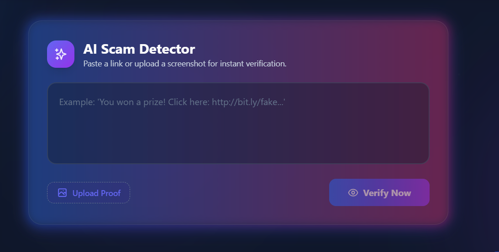
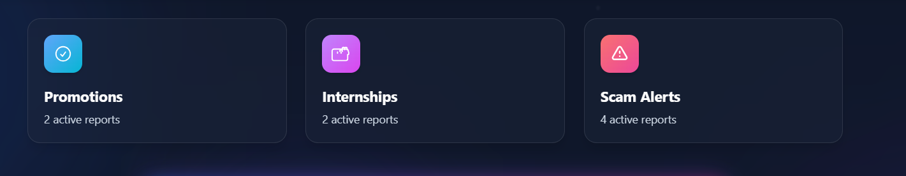
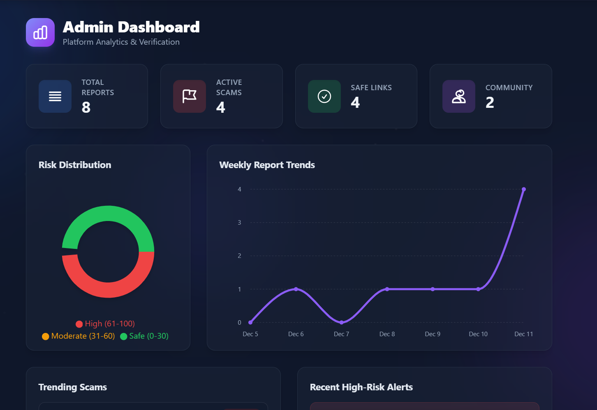
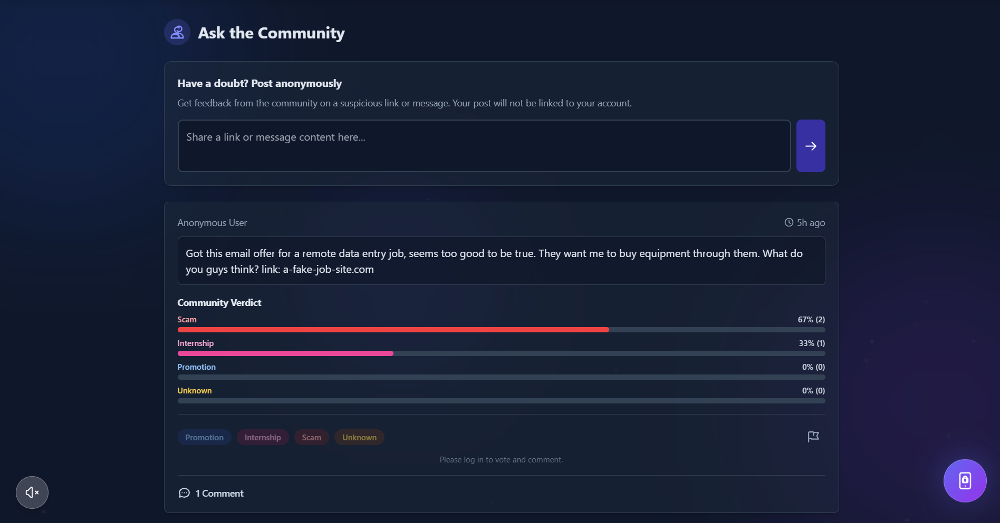
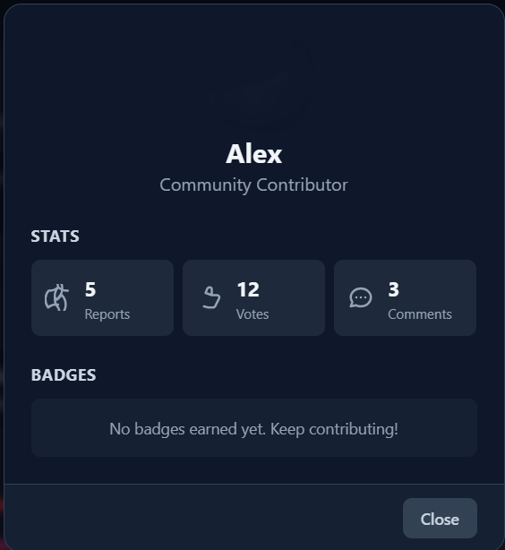

<div align="center">
  <br />
  
  <h1 align="center">TrustLink</h1>
  <p align="center">
    <strong>Verify Before You Trust 🔗</strong>
  </p>
  <p align="center">
    A modern platform helping students validate <b>internships</b>, <b>job offers</b>, and detect <b>scams</b> using AI analysis and community verification.
  </p>

<p align="center">
  <a href="https://trustlink-updated-version.vercel.app/">
    
  </a>
  
  
</p>
</div>

---

## 📸 Preview

<div align="center"> 
  
</div>

<details>
<summary><b>👀 View More Screenshots</b></summary>
<br>

| Section | Screenshot |
| :--- | :--- |
| **Link Input Section** |  |
| **Category View** |  |
| **Dashboard** |  |
| **Community Page** |  |
| **User Profile** |  |
| **Mobile View** |  |

</details>

---

##  Key Features

###  Smart Link Analysis
* **Real-time Scanning:** Paste any internship or offer link for immediate analysis.
* **Trust Score Engine:** Assigns a score (Safe, Suspicious, or Scam) based on domain reputation.
* **Redirect Analysis:** Detects hidden redirects often used in phishing.

###  Category-Based UI
Visual cues help users identify content types instantly:
* 🔵 **Promotions** (Blue)
* 🩷 **Internships** (Pink)
* 🔴 **Scams** (Red)

###  AI & Pattern Detection
* **Keyword Analysis:** Detects suspicious phrases ("urgent", "pay to apply").
* **Pattern Recognition:** Identifies structure common in fake offer letters.
* **ML-Ready:** Backend architecture supports future machine learning integration.

###  Community Power
* **Verification System:** Upvote/downvote offers based on user experience.
* **Reporting:** Flag malicious links immediately.
* **Comments:** Discuss specific opportunities with peers.

### Dashboard & Insights
* **Visual Trends:** Charts showing scam trends vs. legit offers.
* **History:** Track all your past scans and saved insights.

---

##  Tech Stack

| Component | Technology |
| :--- | :--- |
| **Frontend** | React.js (Vite), TailwindCSS, Framer Motion |
| **State Management** | Zustand / Context API |
| **Networking** | Axios |
| **Icons** | React Icons |
| **Deployment** | Vercel (Frontend), Railway/Render (Backend) |

---

##  Project Structure

```bash
trustlink/
│
├── public/                  # Static assets
├── src/
│   ├── components/          # Reusable UI components
│   │   ├── Header.jsx
│   │   ├── LinkInputForm.jsx
│   │   ├── CategoryView.jsx
│   │   ├── Dashboard.jsx
│   │   ├── CommunityView.jsx
│   │   └── ...
│   ├── assets/              # Images and icons
│   │   └── screenshots/     # Images for README
│   ├── context/             # Global state context
│   ├── hooks/               # Custom React hooks
│   ├── utils/               # Helper functions (validators, formatters)
│   ├── App.jsx              # Main application component
│   └── main.jsx             # Entry point
│
├── .env                     # Environment variables
├── package.json             # Dependencies
├── vite.config.js           # Vite configuration
└── README.md                # Documentation
# 🚀 TrustLink

A platform designed to keep students safe online by verifying promotions, internships, and identifying scams.

---

## 📦 Getting Started

Follow the instructions below to set up and run the project locally.

### 🔧 Prerequisites
- **Node.js** (v16 or higher)  
- **npm** or **yarn**

---

## 📥 Installation & Setup

### 1️⃣ Clone the Repository
```bash
git clone https://github.com/your-username/trustlink.git
cd trustlink
Install Dependencies
npm install

3️⃣ Configure Environment

Create a .env file in the root directory and add:

VITE_API_URL=http://localhost:5000
VITE_FIREBASE_KEY=your_firebase_key

4️⃣ Run the Application
npm run dev


Your app will be running at:

http://localhost:5173

🤝 Contributing

Contributions make the open-source community amazing. Any contribution you make is truly appreciated.

Fork the project

Create a feature branch

git checkout -b feature/AmazingFeature


Commit your changes

git commit -m "Add some AmazingFeature"


Push to your branch

git push origin feature/AmazingFeature


Open a Pull Request

📄 License

Distributed under the MIT License.
See the LICENSE file for more information.

👤 Author

Siddhartha Goud
Building tools to make students safer online.

🌐 LinkedIn — www.linkedin.com/in/gilakathi-siddhartha-goud-a51ba3325

💻 GitHub — (https://github.com/siddharthg-7)


